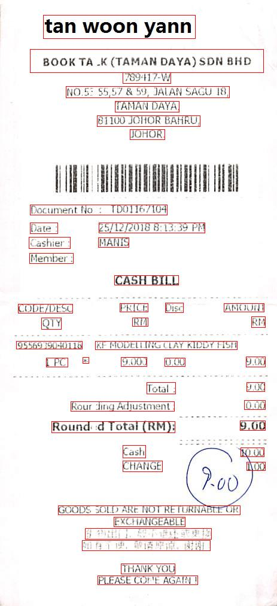

---
language:
- en
license:
- cc-by-4.0
pretty_name: ICDAR2019's Scanned Receipts OCR and Information Extraction (SROIE)
language_creators:
- found
annotations_creators:
- expert-generated
multilinguality:
- monolingual
size_categories:
- n<1K
source_datasets: []
tags:
- receipts
- ocr
task_categories:
- image-to-text
- feature-extraction
- visual-question-answering
- text-retrieval
task_ids:
- visual-question-answering
- document-retrieval
---

# ICDAR2019's Scanned Receipts OCR and Information Extraction (SROIE)

The ICDAR2019 SROIE dataset was originally published by Huang et al. for the
[15th International Conference on Document Analysis and Recognition (ICDAR2019)
Robust Reading Challenge on Scanned Receipts OCR and Information Extraction
(SROIE)](https://rrc.cvc.uab.es/?ch=13).

## Table of Contents
- [Dataset Description](#dataset-description)
  - [Dataset Summary](#dataset-summary)
  - [Supported Tasks and Leaderboards](#supported-tasks-and-leaderboards)
  - [Languages](#languages)
- [Dataset Structure](#dataset-structure)
  - [Data Instances](#data-instances)
  - [Data Fields](#data-fields)
  - [Data Splits](#data-splits)
- [Dataset Creation](#dataset-creation)
  - [Curation Rationale](#curation-rationale)
  - [Source Data](#source-data)
    - [Initial Data Collection and Normalization](#initial-data-collection-and-normalization)
    - [Who are the source language producers?](#who-are-the-source-language-producers)
  - [Annotations](#annotations)
    - [Annotation process](#annotation-process)
    - [Who are the annotators?](#who-are-the-annotators)
  - [Personal and Sensitive Information](#personal-and-sensitive-information)
- [Considerations for Using the Data](#considerations-for-using-the-data)
  - [Social Impact of Dataset](#social-impact-of-dataset)
  - [Discussion of Biases](#discussion-of-biases)
  - [Other Known Limitations](#other-known-limitations)
- [Additional Information](#additional-information)
  - [Dataset Curators](#dataset-curators)
  - [Licensing Information](#licensing-information)
  - [Citation Information](#citation-information)
  - [Contributions](#contributions)

## Dataset Description

* Homepage: [https://rrc.cvc.uab.es/?ch=13](https://rrc.cvc.uab.es/?ch=13)
* Paper: [arXiv:2103.10213](https://arxiv.org/abs/2103.10213)
* License: [Creative Commons Attribution 4.0 International License (CC-BY-4.0)](https://creativecommons.org/licenses/by/4.0/)

This work presents an extension of the original ICDAR2019 SROIE dataset, including 14
receipt annotations missing from the original Task 3 test dataset, in a format
integrated with Hugging Face's `datasets`. This dataset also includes
corrections to the original data and image metadata to easily integrate with a
diverse set of multimodal models with only minor post-processing.

The additions and changes in this dataset are documented in an associated
Github repository: https://github.com/jsdnrs/ICDAR2019-SROIE

### Dataset Summary

The ICDAR2019 SROIE dataset contains 987 receipt images in English, annotated
with key fields (company, date, address, and total) and bounding boxes with
transcripts for all text regions in the images.

The original dataset was created to provide a large-scale and well-annotated
receipt dataset with the goal of recognizing text from scanned structured and
semi-structured receipts, and invoices in general. This dataset also includes
"some special features and challenges, e.g., some receipts having poor paper
quality, poor ink and printing quality; low resolution scanner and scanning
distortion; folded invoices; too many unneeded interfering texts in complex
layouts; long texts and small font sizes" (Huang et al., 2021).

### Supported Tasks and Leaderboards

* **Key Information Extraction (KIE)** - Includes annotations for the company,
  date, address, and total for each receipt image. Additional annotations can
  easily be added for other fields.

* **Optical Character Recognition (OCR)** - Includes bounding boxes and
  transcriptions (words, numbers, and/or symbols) of the text contained within
  those bounding boxes.

* **Document Visual Question Answering (VQA)** - Easily extended to support VQA
  tasks using the existing annotations, such as:
  * "What is the name of the company on this receipt?"
  * "What is the date shown on this receipt?"
  * "What is the address of the company on this receipt?"
  * "What is the final total cost shown on this receipt?"

This dataset is not known to be featured in any leaderboards as of this writing.

### Languages

The dataset contains English-language receipts produced in Malaysia between 2016
and 2018.

## Data Structure

### Data Instances

Each data point includes a receipt `image` with associated fields for
`image_size`, `entities`, `words`, and `bboxes`:
* `bboxes` and `words` include the bounding boxes and associated text
  transcripts for the OCR task (Tasks 1 and 2)
* `entities` includes the fields from the key information extraction task (Task
  3)

An example from the dataset is as follows (the `words` and `bboxes` arrays are
truncated for brevity):

```json
{
  "image": <PIL.JpegImagePlugin.JpegImageFile image mode=RGB size=463x605 at ...>,
  "image_size": {
    "width": 463,
    "height": 605
  },
  "entities": {
    "company": "ABC HO TRADING",
    "date": "09/01/2019",
    "address": "NO.2&4, JALAN HARMONI 3/2, TAMAN DESA HARMONI. 81100 JOHOR BAHRU JOHOR",
    "total": "31.00"
  },
  "words": [
    "TAN CHAY YEE",
    "ABC HO TRADING",
    ... 33 more elements ...
  ],
  "bboxes": [
    [143, 43, 362, 80],
    [129, 86, 309, 111],
    ... 33 more elements ...
  ]
}
```

The following figure shows the receipt `image` from the above example with the
bounding boxes overlaid in red using `torchvision`:

<div style="text-align: center;">
  
</div>


Additional notes on the data instances:
* All text is capitalized even though the text in the receipt images may be
  mixed-case.
* The integer coordinates for the bounding boxes are *not* normalized to the
  image dimensions. Instead they match the default 'xyxy' format used by the
  `torchvision` utilities.
* There is a one-to-one mapping of the elements in the `words` and `bboxes`
  arrays where each element in the `words` array represents the words, numbers,
  and/or symbols within the corresponding bounding box coordinates from the
  `bboxes` array.

<span style="color:red">⚠️ Note: bboxes are in raw pixel values, when using
LayoutLM they must be normalized using the following function (see [Hugging
Face's LayoutLM
Notes](https://huggingface.co/docs/transformers/en/model_doc/layoutlm)):

```python
def normalize_bbox(bbox, width, height):
  return [
    int(1000 * (bbox[0] / width)),
    int(1000 * (bbox[1] / height)),
    int(1000 * (bbox[2] / width)),
    int(1000 * (bbox[3] / height))]
```
</span>


### Data Fields

- `image`: `<PIL.JpegImagePlugin.JpegImageFile image mode=RGB ...>`
- `image_size`: mapping of the `width` and `height` of the image (useful for
  post-processing, if needed)
- `entities`: mapping of the key fields (`company`, `date`, `address`, and
  `total`)
- `words`: array of text region strings containing one or more words, numbers,
  or symbols
- `bboxes`: array of integer pixel coordinates (unnormalized) of the text
  region's bounding box in [x0, y0, x1, y1] format, representing corners with
  (x0, y0) being top left and (x1, y1) being bottom right

### Data Splits

The dataset is split into a 626 training and 347 test images, each with
associated annotations. The criterion for splitting the data is not known.

## Dataset Creation

### Curation Rationale

As stated above, the original dataset was created to provide a large-scale and
well-annotated receipt dataset with the goal of recognizing text from scanned
structured and semi-structured receipts, and invoices in general.

### Source Data

The source data is images of receipts or invoices, largely from Malaysia between
2016 and 2018. The annotations, including bounding boxes and key fields, are
believed to be expert-generated.

#### Initial Data Collection and Normalization

The authors did not provide any details about the data collections process.
However, they do mention that the dataset "has some special features and
challenges, e.g., some receipts having poor paper quality, poor ink and printing
quality; low resolution scanner and scanning distortion; folded invoices; too
many unneeded interfering texts in complex layouts; long texts and small font
sizes" (Huang et al., 2021).

The original bounding box format was given as rectangles with four vertices [x1,
y1, x2, y2, x3, y3, x4, y4], which are in clockwise order starting from the top.
This format is equivalent to the 'xyxyxyxy' format in `torchvision`. This data
was converted by the 'xyxy' format in `torchvision` by storing only the top left
and bottom right vertices [x1, y1, x3, y3].

Refer to the [Modifications to the
Dataset](https://github.com/jsdnrs/ICDAR2019-SROIE#modifications-to-the-dataset)
section of the associated Gihub repository for other additions and changes to
the dataset.

#### Who are the source language producers?

Since the dataset includes images of receipts, it should be considered
machine-generated by point-of-sale systems then printed and
photographed/scanned. While the content of the receipts reflects human
purchases, the receipt information and layout is semi-structured.

### Annotations

#### Annotation process

The original publication describes the annotation format but does not provide
details about the annotation workflow, guidelines, or validation process. Each
receipt image was annotated with:
* Word/region-level text bounding boxes represented with four
  vertices in clockwise order
* A text transcript for each bounding box
* Key information fields (company, date, address, and total)

#### Who are the annotators?

The annotations are provided as part of the ICDAR 2019 Robust Reading Challenge
on Scanned Receipts OCR and Information Extraction. However, the publication
does not report demographic, professional, or institutional information about
the specific annotators. It is also not specified whether the annotations were
produced by academic researchers, industry practitioners, or hired annotators.

### Personal and Sensitive Information

The original authors noted that "to address the potential privacy issue, some
sensitive fields (such as name, address and contact number etc) of the receipts
are blurred" (Huang et al., 2021). However, the dataset still includes many
company names and addresses.


## Considerations for Using the Data

### Social Impact of Dataset

As the original authors have already stated in their publication, this dataset
"plays critical roles in streamlining document-intensive processes and office
automation in many financial, accounting and taxation areas" and "there is an
urgent need to research and develop fast, efficient and robust SROIE systems to
reduce and even eliminate manual work" (Huang et al., 2021).

Ultimately, this dataset supports research in automating document-heavy
workflows such as receipt and invoice processing.

### Discussion of Biases

As mentioned above, the receipts are largely from Malaysia between 2016 and
2018. Therefore, models trained on this dataset might over-index on specific
currency symbols (RM), receipt layouts specific to regional point-of-sale
systems, or how taxes and final total rounding are handled in Malaysia. No steps
were taken to reduce the impact of the potential consequences listed above, but
they are expected to be minor.

<!-- ### Other Known Limitations

There are no known other limitations. -->

## Additional Information

### Dataset Curators

The original dataset was published by Zheng Huang, Kai Chen, Jianhua He, Xiang
Bai, imosthenis Karatzas, Shjian Lu, and C.V. Jawahar for the 15th International
Conference on Document Analysis and Recognition (ICDAR2019).

### Licensing Information

The original dataset is licensed under the
[CC-BY-4.0](https://creativecommons.org/licenses/by/4.0/) as noted on the
ICDAR's Robust Reading Competition website for this dataset:
https://rrc.cvc.uab.es/?ch=13&com=downloads.

The additions and modifications to this dataset do not alter the original
license; redistributed annotations and metadata remain under the
[CC-BY-4.0](https://creativecommons.org/licenses/by/4.0/).

### Citation Information

```
@inproceedings{Huang_2019,
   author     = {Huang, Zheng and Chen, Kai and He, Jianhua and Bai, Xiang and Karatzas, Dimosthenis and Lu, Shijian and Jawahar, C. V.},
   title      = {ICDAR2019 Competition on Scanned Receipt OCR and Information Extraction},
   booktitle = {2019 International Conference on Document Analysis and Recognition (ICDAR)},
   publisher = {IEEE},
   pages     = {1516–-1520},
   year      = {2019},
   doi       = {10.1109/icdar.2019.00244}
}
```

The above reference is available at the following locations:
* [arXiv:2103.10213](https://arxiv.org/abs/2103.10213)
* [doi:10.1109/icdar.2019.00244](https://www.doi.org/10.1109/icdar.2019.00244)

### Contributions

* Additions and minor fixes to this dataset have been made by
[@jsdnrs](https://github.com/jsdnrs).


## Acknowledgements

TODO: Add acknowledgements to other existing datasets.
